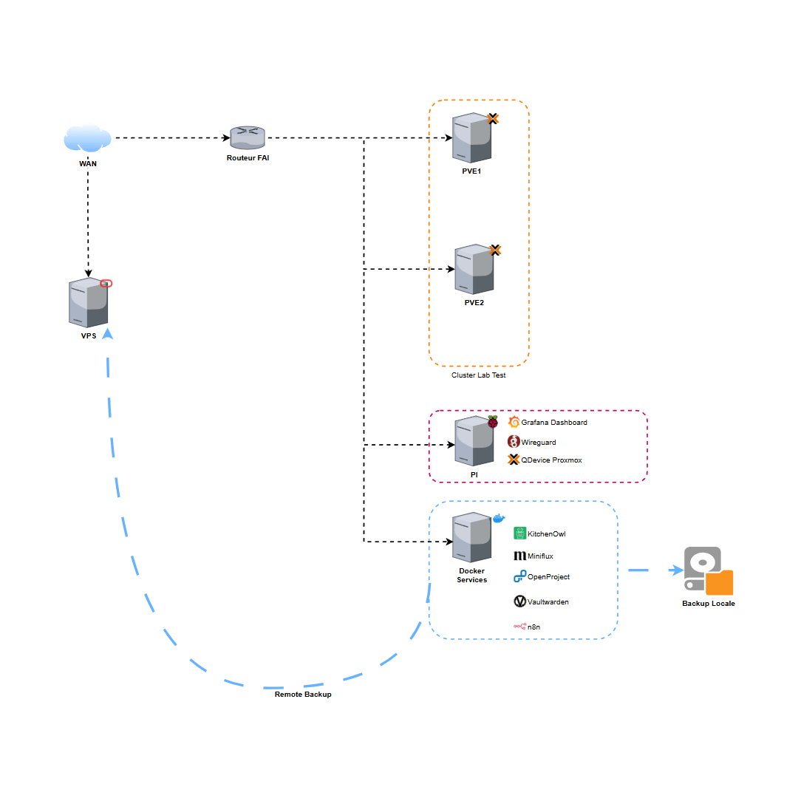

<div align="center">
 
# 🏠 homelab-services
 
**Automatisation, sécurisation et déploiement d'une infrastructure personnelle avec Ansible**
 
[](https://docs.ansible.com/)
[](https://www.proxmox.com/)
[](https://www.raspberrypi.com/)
[](https://rockylinux.org/)
[](https://docs.docker.com/compose/)
[](https://docs.ansible.com/ansible/latest/vault_guide/)
[](LICENSE)
[]()
 


> ⚠️ Projet en évolution active, conçu pour un usage homelab et auto-hébergement
> 🖥️ Tout le processus se fait localement depuis son poste

</div>

---

## Sommaire

- [🎯 Objectifs](#-objectifs)
- [📦 Fonctionnalités](#-fonctionnalités)
- [🔧 Prérequis](#-prérequis)
- [⚙️ Configuration](#️-configuration)
- [🔐 Gestion des secrets](#-gestion-des-secrets-ansible-vault)
- [▶️ Lancer les playbooks](#️-lancer-les-playbooks)
- [📁 Structure du projet](#-structure-du-projet)
- [🔄 Personnalisation](#-personnalisation)

---

## 🎯 Objectifs

Ce projet a pour but de gérer, sécuriser et déployer automatiquement l'ensemble de son infrastructure personnelle :

 - 🐋 Serveur de services à utilisation personnelle (Docker)
 - 🧪 Homelab de test via un cluster Proxmox (PVE)
 - 🍓 Raspberry Pi (Monitoring, VPN, ...)

Le tout en suivant une approche :

 - Automatisée (Ansible)
 - Sécurisée (Hardening, Gestion des secrets)
 - Modulaire
 - Documentée par le code (IaC)

---

## 📦 Fonctionnalités
 - Déploiement automatisé de services Dockers :
   - KitchenOwl
   - Miniflux
   - n8n
   - OpenProject
   - Vaultwarden
 - Gestion des secrets avec Ansible Vault
 - Ports et domaines configurables
 - Hardening système :
   - SSH
   - sysctl
   - fail2ban
 - Support VPN (routage conditionnel)
 - Monitoring (Grafana, Loki, Victoria Metrics) | En cours

---

## 🔧 Prérequis

 - Ansible >= 2.10
 - Accès SSH avec clef publique vers les machines
 - Python installé sur les machines cibles
 - `ansible-vault` configuré
 - Docker installé (ou via le rôle fourni)

---

## ⚙️ Configuration

### 1.Cloner le dépot
  ```bash
git clone https://github.com/cacti-lfs/
  ```

### 2.Configuration des variables

```bash
cp inventory/group_vars/services/vault.yml.example inventory/group_vars/services/vault.yml ansible-vault edit inventory/group_vars/services/vault.yml
```

### 3.Adapter l'inventaire

 - Modifier
  ```bash
  inventory/hosts.yml
  ```
👉 Ajouter vos IP / noms de machines (ou via vault)

### 4.Vérifier la connectivité

```bash
ansible all -m ping --ask-vault-pass
```

## 🔐 Gestion des secrets (Ansible Vault)

 - Commandes essentielles :
    ```bash
    # Chiffrer le fichier de secrets
    ansible-vault encrypt inventory/group_vars/services/vault.yml

    # Éditer les secrets (déchiffre temporairement dans l'éditeur)
    ansible-vault edit inventory/group_vars/services/vault.yml

    # Voir sans éditer
    ansible-vault view inventory/group_vars/services/vault.yml

    # Changer le mot de passe de chiffrement
    ansible-vault rekey inventory/group_vars/services/vault.yml
    ```

 - Vérifier qu'un fichier est bien chiffré avant de pusher
 ```bash
 head -1 inventory/group_vars/services/vault.yml
 ```

### ▶️ Lancer les playbooks

```bash
# Hardening SSH + sysctl + fail2ban sur tous les hôtes
ansible-playbook playbook/hardening.yml --ask-vault-pass

# Déploiement des services Docker sur le M710q
ansible-playbook playbook/docker-services.yml --ask-vault-pass

# Stack de monitoring sur le Raspberry Pi
ansible-playbook playbook/monitoring.yml --ask-vault-pass

# Tout déployer d'un coup
ansible-playbook playbook/site.yml --ask-vault-pass
```

---

## 📁 Structure du projet

```bash
homelab-services/
├── ansible.cfg
├── docs
│   └── schema_architecture_infra.gif
├── inventory
│   ├── group_vars
│   │   ├── all.yml
│   │   ├── homelab-cluster.yml
│   │   ├── pi.yml
│   │   ├── services
│   │   │   └── vault.yml.example
│   │   └── services.yml
│   └── hosts.yml
├── playbook
│   ├── docker-services.yml
│   ├── hardening.yml
│   └── monitoring.yml
├── README.md
├── roles
│   ├── docker
│   │   ├── default
│   │   ├── handlers
│   │   ├── tasks
│   │   │   └── main.yml
│   │   └── template
│   ├── docker_services
│   │   ├── default
│   │   ├── handlers
│   │   ├── tasks
│   │   │   └── main.yml
│   │   └── template
│   ├── fail2ban_install
│   │   ├── default
│   │   ├── handlers
│   │   │   └── main.yml
│   │   ├── tasks
│   │   │   └── main.yml
│   │   └── template
│   ├── monitoring
│   │   ├── default
│   │   ├── handlers
│   │   ├── tasks
│   │   │   └── main.yml
│   │   └── template
│   ├── SSH_Hardening
│   │   ├── default
│   │   │   └── main.yml
│   │   ├── handlers
│   │   │   └── main.yml
│   │   ├── tasks
│   │   │   └── main.yml
│   │   └── template
│   └── sysctl_config
│       ├── default
│       ├── handlers
│       │   └── main.yml
│       ├── tasks
│       │   └── main.yml
│       └── template
└── services
    ├── kitchenowl
    │   └── docker-compose.yml.j2
    ├── miniflux
    │   └── docker-compose.yml.j2
    ├── n8n
    │   └── docker-compose.yml.j2
    ├── openproject
    │   └── docker-compose.yml.j2
    └── vaultwarden
        └── docker-compose.yml.j2
```

## Personnalisation

Le projet est conçu pour être forké facilement :
 
| Quoi modifier | Où |
|---|---|
| Ports des services | `inventory/group_vars/services.yml` |
| Secrets et tokens | `inventory/group_vars/services/vault.yml` |
| Activer/désactiver des services | `playbook/docker-services.yml` |
| Ajouter une machine | `inventory/hosts.yml` + group_vars correspondant |
| Paramètres SSH | `roles/ssh_hardening/defaults/main.yml` |

---

<div align="center">
 
📝 [Blog technique](https://ldtr.ovh) · 😺 [GitHub](https://github.com/cacti-lfs) · 💼 [LinkedIn](https://linkedin.com/in/loïs-dutour)

</div>